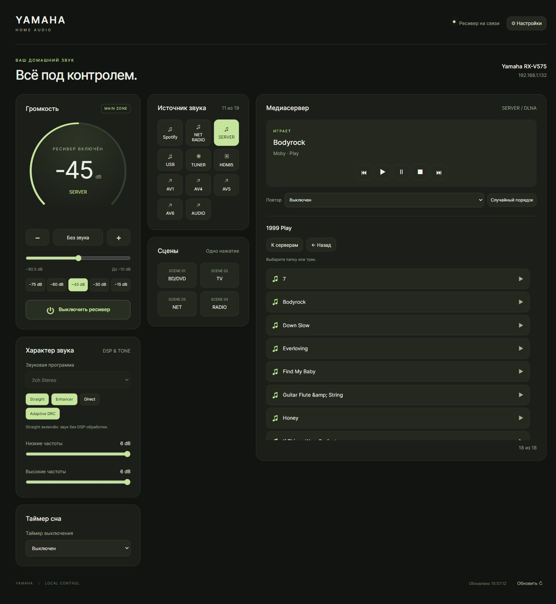
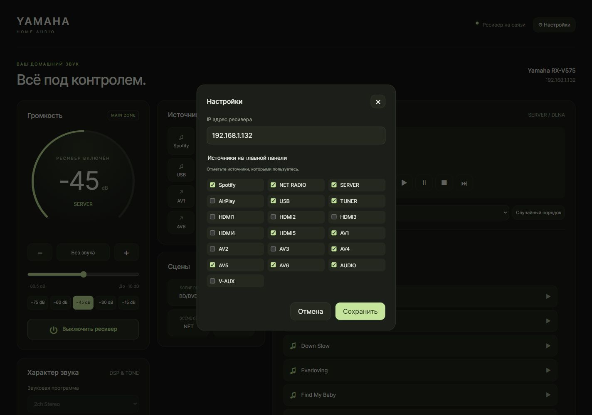
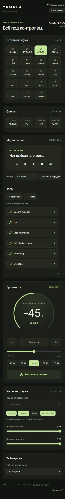

# YamaDeck

**Your Yamaha receiver, one browser tab away.**

English · [Русский](README.ru.md)

A self-hosted web remote for Yamaha network receivers, built and tested with the **RX-V575**. Control your receiver, browse a DLNA library, tune radio stations, and choose which inputs appear on the dashboard. Run it with Docker on a computer or NAS in your home network.

Python standard library on the server; plain HTML, CSS, and JavaScript in the browser. No npm build or cloud account required. The current interface is in Russian.

## Screenshots

### Dashboard and SERVER / DLNA



### Settings



### Mobile layout



Screenshots show the running application connected to an RX-V575. Input names and library contents come from the receiver.

## Features

| Area | Controls |
| --- | --- |
| Power and volume | Main-zone power, mute, slider, ±1 dB; presets −75, −60, −45, −30, and −15 dB. |
| Inputs and scenes | Receiver-provided inputs and four scenes; hide unused inputs in Settings. |
| Sound | DSP programs, Straight, Enhancer, Direct, Adaptive DRC, bass, and treble. |
| SERVER / DLNA | Servers, folders, and tracks; back/home navigation; play/pause/stop, previous/next, repeat, shuffle, song/artist/album. |
| Radio | FM/AM, frequency entry and stepping, auto search and cancellation, saved stations and previous/next preset. |
| RDS | Station names, radio text, signal/stereo status; learned names appear in the station selector. |
| Other sources | Transport controls for supported network/USB inputs; availability depends on the receiver and source. |
| Sleep timer | Off or 30, 60, 90, and 120 minutes. |
| Settings | Receiver IP and checkboxes for visible inputs, saved across restarts. |

State refreshes every five seconds while the tab is visible. Status, configuration, metadata, radio, and lists load asynchronously. Entries in the **current folder** preload in the background without page buttons. Loaded rows remain usable, their DOM nodes and scroll position are preserved, and user navigation cancels speculative loading. Stale responses are discarded.

RDS names are saved after two matching observations while tuned to a station. Names are associated with receiver/frequency and shared across browsers; a temporary absence of RDS does not erase them. Stations without a received name keep the frequency label. There is no automatic scan of all radio stations.

## Compatibility and requirements

- Verified hardware: **Yamaha RX-V575**, using `/YamahaRemoteControl/ctrl` XML commands. Other models with this protocol may work but are untested; this is not a MusicCast API client.
- Docker with Docker Compose, or Docker Desktop on Windows/macOS.
- The Docker host must reach the receiver over the LAN. For SERVER playback, the **receiver** must also discover your DLNA server.
- A modern browser; a phone on the same LAN can use the same controller.
- Enable **Network Standby** for network power-on. A DHCP reservation is recommended.

Tuning ranges for the tested RX-V575: FM 87.50–108.00 MHz, step 0.05 MHz; AM 531–1611 kHz, step 9 kHz.

## Deploy with Docker

Download and extract the repository ZIP, or clone the GitHub repository:

```sh
git clone https://github.com/pilotag812/yamadeck.git
cd yamadeck
```

Copy the configuration example:

```sh
# Linux / macOS
cp .env.example .env
```

```powershell
# Windows PowerShell
Copy-Item .env.example .env
```

Edit `.env`, replacing the sample IP with your receiver's address:

```dotenv
RECEIVER_HOST=192.168.1.100
WEB_PORT=8095
MAX_VOLUME_DB=-10
```

Build and start:

```sh
docker compose up -d --build
```

Open [http://localhost:8095](http://localhost:8095). From a phone, use `http://<docker-host-ip>:8095`. Click **⚙ Настройки** (Settings) to change the receiver IP and select visible inputs.

The same Compose file works on Linux and NAS systems that support Docker Compose. Build from this source directory, publish the web port, and ensure the host can reach the receiver. Host networking is not required. A prebuilt container image has not been published.

### Configuration

| Variable | Default in supplied files | Purpose |
| --- | --- | --- |
| `RECEIVER_HOST` | `192.168.1.132` | Initial receiver address; replace for your LAN. |
| `WEB_PORT` | `8095` | Published web port. |
| `MAX_VOLUME_DB` | `-10` | Upper limit for volume commands from YamaDeck. |

The IP saved in Settings **overrides** `RECEIVER_HOST`. Settings remains available when the receiver is offline; the input checklist loads after a successful connection.

`MAX_VOLUME_DB` accepts −80.5…+16.5 dB in 0.5 dB steps. It limits only this web controller, not the physical remote or other apps. Presets above the limit are disabled. After editing `.env`, run `docker compose up -d` again.

### Persistent data

The named volume `radio-data`, mounted at `/data`, stores `settings.json` (IP and visible inputs) and `radio-names.json` (RDS names). Data survives container updates and ordinary `docker compose down`. **`docker compose down --volumes` deletes it.** Keep the Compose project name when migrating an existing installation: renaming the directory/project can select a different volume.

## Updates and maintenance

After downloading updated source or running `git pull` in a published repository:

```sh
docker compose up -d --build
docker compose ps
docker compose logs --tail 50
```

Stop while retaining data with `docker compose down`. The healthcheck tests the web server, not receiver connectivity. The UI reports connection failures and retries automatically.

## Run without Docker

Use Python 3.13, as in the container. No third-party Python packages are required.

```sh
# Linux / macOS
RECEIVER_HOST=192.168.1.100 MAX_VOLUME_DB=-10 python server.py
```

```powershell
# Windows PowerShell
$env:RECEIVER_HOST = '192.168.1.100'
$env:MAX_VOLUME_DB = '-10'
python server.py
```

Open [http://localhost:8080](http://localhost:8080). `PORT` changes the listening port; `DATA_DIR` changes the data directory (default: `data/` beside `server.py`). Direct Python startup does not load `.env`; Compose reads it for Docker deployment.

## Checks

```sh
python -m unittest discover -s tests -v
node tests/test_frontend.cjs
```

Tests use a fake receiver and recorded XML; they never send commands to real hardware. Frontend checks cover background loading, usable rows, stable DOM, and stale responses. Node.js is needed for the frontend check only, not deployment.

## Troubleshooting

| Symptom | Check |
| --- | --- |
| Receiver is offline | IP in Settings, LAN connectivity, Network Standby. |
| Phone cannot open the UI | Docker host IP, published port, firewall, LAN connectivity. |
| No DLNA servers | The receiver must see the server; check discovery, library sharing, network isolation. |
| DSP/tone controls disabled | Disable Straight/Direct as appropriate; Direct bypasses tone controls. |
| Radio shows frequency only | Wait for RDS and two matching observations; some stations provide no name. |
| Old IP after editing `.env` | Change Settings; the saved address takes precedence. |

## Security and publication

Designed for a **trusted home LAN**. There is no built-in login or HTTPS. Do not expose the port directly to the internet; use a VPN for remote access. Custom JSON headers and same-origin checks are not authentication.

YamaDeck is independent and not affiliated with Yamaha. Repository: [pilotag812/yamadeck](https://github.com/pilotag812/yamadeck). GitHub hosts the source; the controller runs on your Docker host, not GitHub Pages. A license has not yet been selected; choose one before public distribution.

References: [Compose deployment](https://docs.docker.com/reference/cli/docker/compose/up/), [Compose variables](https://docs.docker.com/compose/how-tos/environment-variables/variable-interpolation/), [Docker volumes](https://docs.docker.com/engine/storage/volumes/), [Yamaha XML protocol notes](https://github.com/christianfl/av-receiver-docs).
